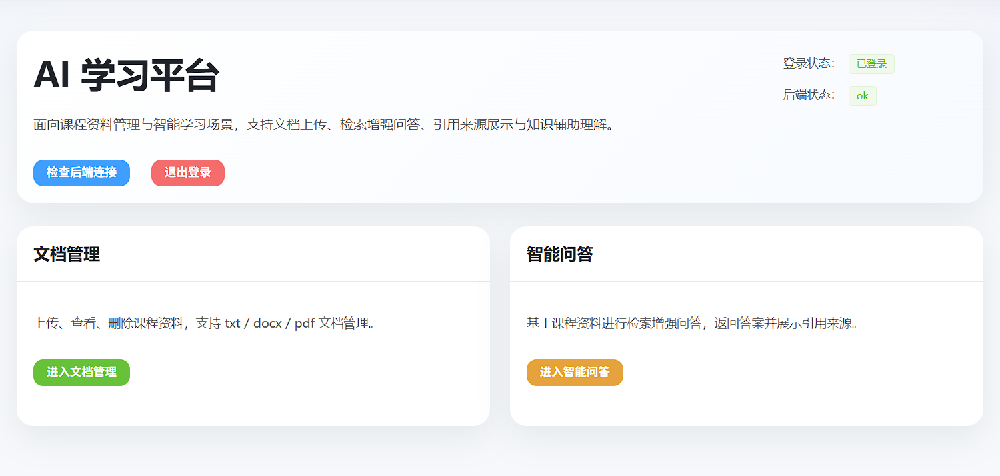
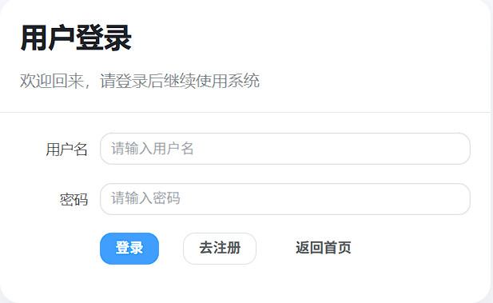
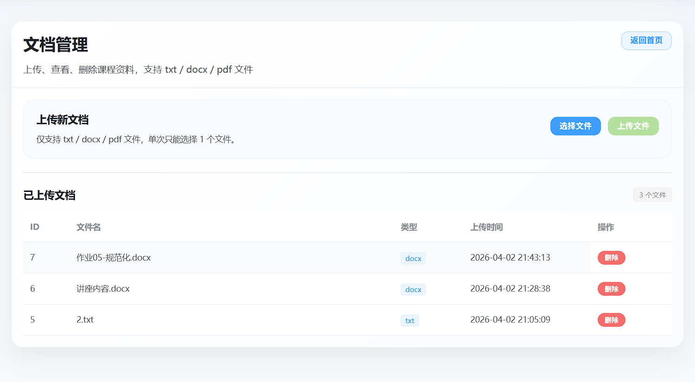
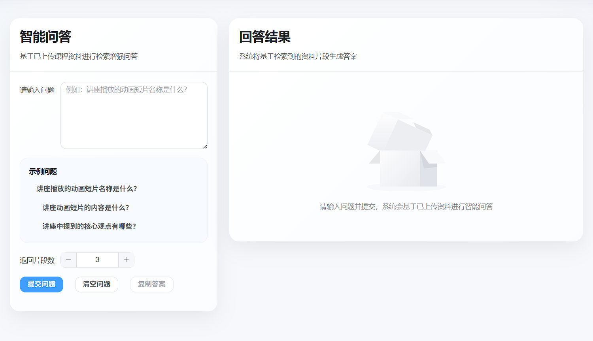

# AI Study Platform

<p align="center">
  <strong>一个基于 Vue 3 + FastAPI + MySQL + FAISS + RAG 的课程资料智能问答与文档管理系统</strong>
</p>


<p align="center">
  面向课程资料管理与智能学习场景，支持文档上传、内容解析、文本切分、向量检索、检索增强问答与引用来源展示。
</p>


<p align="center">
  
  
  
  
  
</p>


---

## 项目亮点

- 支持 **txt / docx / pdf** 课程资料上传、删除与管理
- 支持文档自动解析、文本切分与 chunk 入库
- 基于 **sentence-transformers + FAISS** 实现向量检索
- 基于 **RAG** 流程完成资料增强问答
- 回答结果支持 **引用来源展示**，提高可解释性
- 采用 **Vue + FastAPI** 前后端分离架构，具备较强扩展性

---

## 项目预览

系统主要页面包括：

## 项目预览

本项目主要包含以下核心页面：

- 首页
- 登录 / 注册页
- 文档管理页
- 智能问答页

### 首页预览

<p align="center">
  
</p>

### 功能页面预览

<p align="center">
  
  
  
</p>

<p align="center">
  <sub>登录页 / 文档管理页 / 智能问答页</sub>
</p>

<details>
  <summary><b>查看详细页面截图</b></summary>

  <br />

  #### 登录页
  <p align="center">
    
  </p>

  #### 文档管理页
  <p align="center">
    
  </p>

  #### 智能问答页
  <p align="center">
    
  </p>

</details>

---

## 功能模块

### 1. 用户模块

- 用户注册
- 用户登录
- 登录态本地保存
- 路由守卫控制访问权限

### 2. 文档管理模块

- 上传 txt / docx / pdf 文件
- 查看文档列表
- 删除文档
- 删除后同步删除 chunks 与索引数据

### 3. 文档处理模块

- 文档内容解析
- 文本切分
- chunk 入库
- 按文档查看 chunks

### 4. 检索模块

- 生成文本向量
- 构建 FAISS 索引
- 根据用户问题检索 top-k 相关片段

### 5. 智能问答模块

- 基于检索结果构造 Prompt
- 调用大模型生成回答
- 返回答案与引用来源
- 前端展示 answer + sources

---

## 技术栈

### 前端

- Vue 3
- Vite
- Vue Router
- Pinia
- Element Plus
- Axios

### 后端

- FastAPI
- SQLAlchemy
- PyMySQL
- Python-dotenv
- Python-multipart

### 数据库

- MySQL 5.7

### 文档处理

- PyMuPDF
- python-docx

### 向量检索

- sentence-transformers
- FAISS

### 大模型调用

- OpenAI SDK（兼容 OpenAI 格式接口）

---

## 系统架构

```text
用户提问
   ↓
前端 Vue 页面
   ↓
FastAPI 问答接口
   ↓
FAISS 检索相关 chunks
   ↓
构造 Prompt
   ↓
调用大模型生成答案
   ↓
返回 answer + sources
```

### 文档处理流程

```text
上传文档
→ 保存原文件
→ 解析文本内容
→ 切分为 chunks
→ 写入 MySQL
→ 生成向量
→ 构建 / 重建 FAISS 索引
```

### 问答流程

```text
用户输入问题
→ 检索 top-k 相关 chunks
→ 拼接 Prompt
→ 调用大模型
→ 返回答案与引用来源
→ 前端展示结果
```

---

## 项目结构

```text
ai-study-platform/
├── frontend/
│   └── frontend-app/
│       ├── src/
│       │   ├── api/
│       │   ├── components/
│       │   ├── router/
│       │   ├── views/
│       │   ├── App.vue
│       │   ├── main.js
│       │   └── style.css
│       ├── package.json
│       └── ...
├── backend/
│   ├── app/
│   │   ├── api/
│   │   ├── core/
│   │   ├── models/
│   │   ├── schemas/
│   │   ├── services/
│   │   └── main.py
│   ├── requirements.txt
│   ├── uploads/
│   ├── faiss_index/
│   └── .env
├── .gitignore
└── README.md
```

---

## 运行环境

- Node.js 20+
- Python 3.11
- MySQL 5.7
- npm
- pip / venv

> 首次运行前，请先自行配置后端 `.env` 文件中的数据库和大模型接口参数。

---

## 环境变量配置

后端 `.env` 示例：

```env
MYSQL_USER=root
MYSQL_PASSWORD=你的数据库密码
MYSQL_HOST=127.0.0.1
MYSQL_PORT=3306
MYSQL_DB=ai_study_platform

OPENAI_API_KEY=你的API_KEY
OPENAI_BASE_URL=你的兼容OpenAI接口地址
OPENAI_MODEL=你的模型名称
```

---

## 后端启动

进入 backend 目录：

```bash
cd backend
python -m venv .venv
.venv\Scripts\activate
pip install -r requirements.txt
uvicorn app.main:app --reload
```

后端默认地址：

```text
http://127.0.0.1:8000
```

Swagger 文档：

```text
http://127.0.0.1:8000/docs
```

---

## 前端启动

进入 frontend 项目目录：

```bash
cd frontend/frontend-app
npm install
npm run dev
```

前端默认地址：

```text
http://localhost:5173
```

---

## 当前已实现

- [x] 用户注册登录
- [x] 登录态控制与路由守卫
- [x] 文档上传 / 删除
- [x] 文档解析与文本切分
- [x] chunk 入库
- [x] FAISS 向量检索
- [x] RAG 问答
- [x] 引用来源展示
- [x] 前端产品化界面优化

---

## 后续可优化方向

- [ ] 文档去重
- [ ] 文档摘要生成
- [ ] 问答历史保存
- [ ] 支持更多文件格式
- [ ] 支持 OCR 扫描文档
- [ ] 支持按文档范围问答
- [ ] 支持多轮对话
- [ ] 支持本地模型部署
- [ ] 支持项目部署上线

---

## 项目定位

本项目定位为 **大模型工程应用实践项目**，重点展示：

- 前后端分离系统设计能力
- 文档处理与数据入库能力
- 向量检索与 RAG 流程实现能力
- 大模型接口调用与结果展示能力
- 面向真实场景的产品化包装能力

---


## License

本项目仅用于学习、课程实践与个人作品展示。

